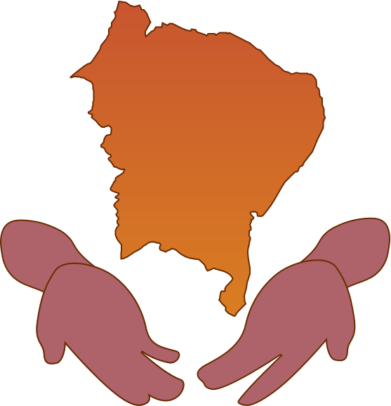

    

--------

    

| English | [Português](README.md) |
| --- | --- |

## Motivation

Cabreira (*Brazilian Portuguese pronunciation:* [[kabɾˈejɾa]](https://en.wikipedia.org/wiki/Help:IPA/Portuguese)) is a tool made to expose the real impact of droughts in Brazil's northeastern region, all in a simple and accessible interface. For that, a new metric of climate vulnerability was created, joining multiple socioeconomic data and drought intensity metrics from [Monitor de Secas](http://monitordesecas.ana.gov.br/mapa) (literally, _Drought Monitor_).

There's already a heavy focus on natural and social issues driven towards major brazilian cities - e.g. São Paulo - and forests - e.g. Amazon rainforest. This specialized treatment favors a scenario of political and academic neglect for the northeast, as for its people, wealth and problems. Nature, on the other hand, does not neglect - over half of the disaster-related impacts in Brazil come from droughts:

> Source: [Atlas Brasileiro de Desastres Naturais](https://s2id.mi.gov.br/paginas/atlas/). Sistema Integrado de Informações sobre Desastres, 2013.

## Why the name?

The word *cabreira* in brazilian portuguese is an adjective that can take many meanings. Formally it could refer to the *Botrychium lunaria* plant, or even a female goatherd.
But those are not the meanings behind this project's name - its inspiration comes from the informal use of the word.

Brazil's northeastern population is the one regional pioneer for the informal use of *cabreira*, meaning a person who's deeply angry, wary, or most frequently: suspicious. Both these discontent emotional states and the social motivation for this project seem to fit perfectly beside one another. A land inhabited by the most humble, simple people, is laid barren, under burning heat yet remains a tourism paradise. Meanwhile, it seems the only realistic scenario for creating change is for the local economical/political "elite" to *feel* it's becoming inhabitable for them too, at least in the long run. Angry, wary and suspicious, all in one? It's a good fit.
