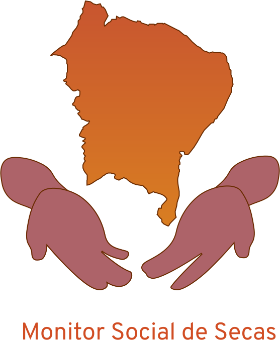
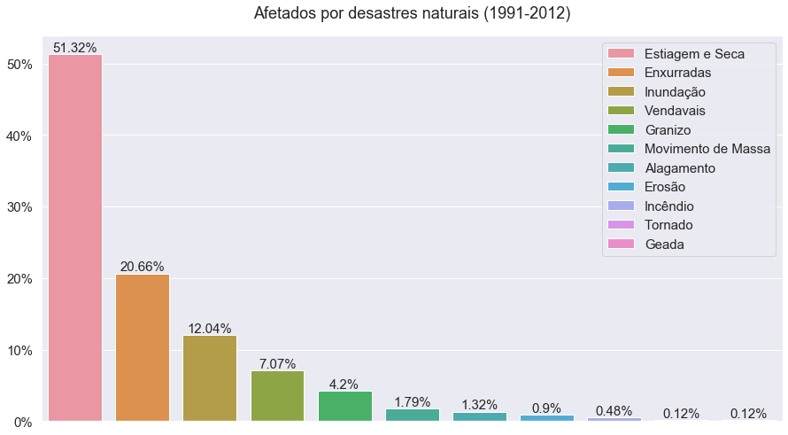

    <a href="#">
        
    <a/>

--------

    <a href="https://app.codacy.com/manual/jcezarms/monitor-social-de-secas?utm_source=github.com&utm_medium=referral&utm_content=jcezarms/monitor-social-de-secas&utm_campaign=Badge_Grade_Dashboard">
        
    

## Motivação
O Monitor Social de Secas, construído a partir do [Monitor de Secas](http://monitordesecas.ana.gov.br/mapa), tem como objetivo agregar a vulnerabilidade climática à intensidade das secas nordestinas, deixando mais claro e acessível o real impacto da estiagem na região.

Já existe um grande foco nos aspectos naturais e sociais dos maiores polos econômicos urbanos - e.g. São Paulo - e nos maiores polos florestais - e.g. Floresta Amazônica - do Brasil. Essa atenção localizada traz um cenário de descaso político e acadêmico ao nordeste, sua população, suas riquezas e chagas. Porém, a natureza não negligencia - mais da metade da população afligida por desastres naturais provém da seca:

> Vide [Atlas Brasileiro de Desastres Naturais](https://s2id.mi.gov.br/paginas/atlas/). Sistema Integrado de Informações sobre Desastres, 2013.