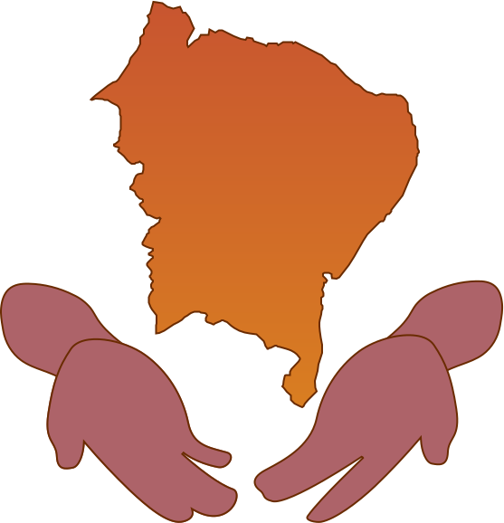
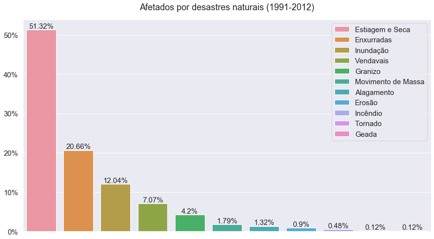

    

--------

    

| [English](README-enUS.md) | Português |
| --- | --- |

## Motivação
Cabreira é uma ferramenta que expõe o real impacto da estiagem nordestina, numa interface simples e acessível. Para isso, foi criado um indicador único de vulnerabilidade climática que agrega diversos dados sociais a métricas de intensidade do [Monitor de Secas](http://monitordesecas.ana.gov.br/mapa).

Já existe um grande foco nos aspectos naturais e sociais dos maiores polos econômicos urbanos - e.g. São Paulo - e florestais - e.g. Floresta Amazônica - do Brasil. Essa atenção localizada traz um cenário de descaso político e acadêmico ao nordeste, sua população, suas riquezas e chagas. Porém, a natureza não negligencia - mais da metade da população afligida por desastres naturais provém da seca:

> Vide [Atlas Brasileiro de Desastres Naturais](https://s2id.mi.gov.br/paginas/atlas/). Sistema Integrado de Informações sobre Desastres, 2013.